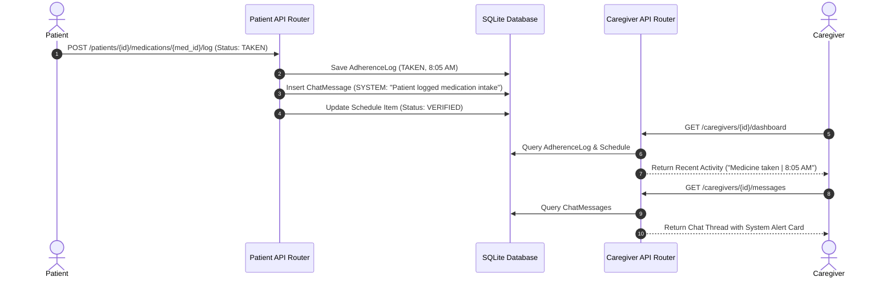

# Caregiver App & Patient Integration API Specification

This document details all backend API endpoints required for the **Caregiver Mobile Application** (matching the provided UI designs: Home Overview, Care Schedule, Messages, and Profile) and their end-to-end integration with **Patient** actions in AyuSync.

---

## Executive Summary & Access Control Policy

### Caregiver Permissions & Scope
- **Read-Only Access for Clinical Data**: Caregivers **cannot** alter doctor prescriptions, mark medications as taken, or edit patient clinical records.
- **Operational & Communication Actions**: Caregivers **can** execute operational tasks such as arranging transport for lab visits, acknowledging care schedule items, and sending messages to the patient.
- **Real-Time Patient Event Synchronization**: When a patient marks medication intake, chats with the AI assistant, or logs vitals, events are propagated to the Caregiver app's Home Timeline, Care Schedule, and Messages thread.

---

## UI Component to API Mapping Matrix

| Screen | UI Component | Required API Endpoint | HTTP Method |
| :--- | :--- | :--- | :--- |
| **1. Overview (Home)** | Patient Header & Vitals Badge | `/api/v1/caregivers/{caregiver_id}/dashboard` | `GET` |
| **1. Overview (Home)** | At-a-Glance Grid (Medication, Lab, Checkup) | `/api/v1/caregivers/{caregiver_id}/dashboard` | `GET` |
| **1. Overview (Home)** | Action Required Banner (*Arrange Transport*) | `/api/v1/caregivers/{caregiver_id}/dashboard` | `GET` |
| **1. Overview (Home)** | Arrange Transport Button Action | `/api/v1/caregivers/{caregiver_id}/actions/arrange-transport` | `POST` |
| **1. Overview (Home)** | Recent Activity Timeline Stream | `/api/v1/caregivers/{caregiver_id}/dashboard` | `GET` |
| **2. Care Schedule** | Daily Care Events List | `/api/v1/caregivers/{caregiver_id}/schedule` | `GET` |
| **2. Care Schedule** | Dose Verification Item (*Rahul confirmed...*) | `/api/v1/caregivers/{caregiver_id}/schedule` | `GET` |
| **2. Care Schedule** | Confirm Transport Button Action (`[Take Action]`) | `/api/v1/caregivers/{caregiver_id}/schedule/{id}/action` | `POST` |
| **2. Care Schedule** | Afternoon Check-in Call Card | `/api/v1/caregivers/{caregiver_id}/schedule` | `GET` |
| **3. Messages** | Chat Thread Messages & History | `/api/v1/caregivers/{caregiver_id}/messages` | `GET` |
| **3. Messages** | System Alert Bubble (*Patient logged medication*) | `/api/v1/caregivers/{caregiver_id}/messages` | `GET` |
| **3. Messages** | Message Input & Send Button | `/api/v1/caregivers/{caregiver_id}/messages` | `POST` |
| **4. Profile** | Caregiver Info Card & Relationship Tag | `/api/v1/caregivers/{caregiver_id}/profile` | `GET` |
| **4. Profile** | Account Settings & Preferences | `/api/v1/caregivers/{caregiver_id}/profile` | `PUT` |

---

## Detailed API Specifications

### Screen 1: Home Overview APIs

#### 1.1 Get Dashboard Overview & Recent Activity
- **Endpoint**: `GET /api/v1/caregivers/{caregiver_id}/dashboard`
- **Description**: Returns all data required for the Home tab overview cards, action alerts, and recent patient activity feed.
- **Path Parameters**:
  - `caregiver_id` (string, required): Unique Caregiver User ID.
- **Success Response (`200 OK`)**:
```json
{
  "status": "success",
  "patient": {
    "id": "pat_88192",
    "name": "Rahul Kumar",
    "photo_url": "https://images.unsplash.com/photo-1534528741775-53994a69daeb",
    "vitals_status": "Stable",
    "vitals_color": "green",
    "last_updated": "Just now"
  },
  "glance": [
    { "id": "med", "icon": "pill", "title": "Medication", "status": "Done", "color": "green" },
    { "id": "lab", "icon": "droplet", "title": "Blood Test", "status": "Tomorrow", "color": "amber" },
    { "id": "appt", "icon": "calendar", "title": "Checkup", "status": "4:00 PM", "color": "primary" }
  ],
  "alerts": [
    {
      "id": "alert_101",
      "text": "Transport unconfirmed for tomorrow's lab visit.",
      "type": "Action Required",
      "action_type": "ARRANGE_TRANSPORT",
      "color": "amber"
    }
  ],
  "timeline": [
    {
      "id": "act_01",
      "icon": "checkCircle2",
      "title": "Medicine taken",
      "time": "8:05 AM",
      "color": "green"
    },
    {
      "id": "act_02",
      "icon": "fileText",
      "title": "Blood test scheduled",
      "time": "10:00 AM",
      "color": "primary"
    },
    {
      "id": "act_03",
      "icon": "calendar",
      "title": "Appointment confirmed",
      "time": "4:00 PM",
      "color": "primary"
    }
  ]
}
```

#### 1.2 Arrange Transport for Lab Visit / Appointment
- **Endpoint**: `POST /api/v1/caregivers/{caregiver_id}/actions/arrange-transport`
- **Description**: Triggered when the caregiver clicks `[Arrange Transport]`.
- **Request Body**:
```json
{
  "patient_id": "pat_88192",
  "alert_id": "alert_101",
  "pickup_location": "Patient Home Address",
  "destination": "Apollo Diagnostic Lab",
  "scheduled_time": "2026-09-05T09:30:00Z"
}
```
- **Success Response (`200 OK`)**:
```json
{
  "status": "success",
  "message": "Transport dispatch created successfully.",
  "dispatch_id": "disp_44102"
}
```

---

### Screen 2: Care Schedule APIs

#### 2.1 Get Daily Care Schedule
- **Endpoint**: `GET /api/v1/caregivers/{caregiver_id}/schedule`
- **Description**: Returns all scheduled care timeline items for a given date.
- **Query Parameters**:
  - `date` (string, optional, e.g. `2026-09-04`): Selected date (defaults to current date).
- **Success Response (`200 OK`)**:
```json
{
  "status": "success",
  "date": "2026-09-04",
  "schedule_items": [
    {
      "id": "sch_01",
      "scheduled_time": "08:00 AM",
      "title": "Verify Morning Dose",
      "description": "Rahul confirmed dose taken at 8:05 AM.",
      "status": "VERIFIED",
      "icon": "checkCircle2",
      "color": "green",
      "has_action": false
    },
    {
      "id": "sch_02",
      "scheduled_time": "10:00 AM",
      "title": "Confirm Transport",
      "description": "Pending action for 10:00 AM Blood Test tomorrow.",
      "status": "ACTION_REQUIRED",
      "icon": "truck",
      "color": "amber",
      "has_action": true,
      "action_label": "Take Action"
    },
    {
      "id": "sch_03",
      "scheduled_time": "02:00 PM",
      "title": "Afternoon Check-in",
      "description": "Scheduled call with patient.",
      "status": "SCHEDULED",
      "icon": "phone",
      "color": "grey",
      "has_action": false
    }
  ]
}
```

#### 2.2 Execute Schedule Item Action
- **Endpoint**: `POST /api/v1/caregivers/{caregiver_id}/schedule/{schedule_id}/action`
- **Description**: Executed when caregiver clicks `[Take Action]` on a schedule card.
- **Request Body**:
```json
{
  "action": "CONFIRM_TRANSPORT",
  "notes": "Transport verified with local driver."
}
```
- **Success Response (`200 OK`)**:
```json
{
  "status": "success",
  "message": "Schedule action recorded successfully.",
  "schedule_id": "sch_02"
}
```

---

### Screen 3: Messages & System Alerts APIs

#### 3.1 Get Chat History & System Alerts
- **Endpoint**: `GET /api/v1/caregivers/{caregiver_id}/messages`
- **Description**: Fetches all chat messages exchanged between caregiver and patient, interspersed with automated System Alert cards.
- **Success Response (`200 OK`)**:
```json
{
  "status": "success",
  "thread_id": "th_cg_pat_102",
  "messages": [
    {
      "id": "m1",
      "sender_type": "CAREGIVER",
      "sender_name": "Priya Kumar",
      "text": "Good morning! How are you feeling today?",
      "time": "08:00 AM",
      "is_system_alert": false
    },
    {
      "id": "m2",
      "sender_type": "PATIENT",
      "sender_name": "Rahul Kumar",
      "sender_avatar": "https://example.com/avatar.jpg",
      "text": "Hi, I finished my morning walk. Heart rate felt normal.",
      "time": "08:15 AM",
      "is_system_alert": false
    },
    {
      "id": "m3",
      "sender_type": "CAREGIVER",
      "sender_name": "Priya Kumar",
      "text": "That is great to hear! Remember to take your morning medication.",
      "time": "08:17 AM",
      "is_system_alert": false
    },
    {
      "id": "m4",
      "sender_type": "SYSTEM",
      "sender_name": "System Alert",
      "text": "Patient logged medication intake.",
      "time": "08:18 AM",
      "is_system_alert": true,
      "alert_icon": "bell"
    }
  ]
}
```

#### 3.2 Send Message to Patient
- **Endpoint**: `POST /api/v1/caregivers/{caregiver_id}/messages`
- **Description**: Sends a message from the caregiver to the patient.
- **Request Body**:
```json
{
  "patient_id": "pat_88192",
  "text": "Glad to hear that. I will call you at 2:00 PM for check-in."
}
```
- **Success Response (`200 OK`)**:
```json
{
  "status": "success",
  "message_id": "m5",
  "timestamp": "08:20 AM"
}
```

---

### Screen 4: Caregiver Profile & Settings APIs

#### 4.1 Get Profile Information
- **Endpoint**: `GET /api/v1/caregivers/{caregiver_id}/profile`
- **Description**: Fetches caregiver profile card information and preferences.
- **Success Response (`200 OK`)**:
```json
{
  "status": "success",
  "caregiver": {
    "id": "cg_456",
    "full_name": "Priya Kumar",
    "role": "Primary Family Caregiver",
    "relationship": "Daughter",
    "phone_number": "+91 9876543210",
    "avatar_url": "https://example.com/priya.jpg"
  },
  "settings": {
    "language": "English (US)",
    "notifications": "All enabled",
    "privacy_level": "Standard"
  }
}
```

#### 4.2 Update Profile Settings
- **Endpoint**: `PUT /api/v1/caregivers/{caregiver_id}/profile`
- **Description**: Updates preferences such as language or notification options.
- **Request Body**:
```json
{
  "language": "English (US)",
  "notifications": "All enabled"
}
```
- **Success Response (`200 OK`)**:
```json
{
  "status": "success",
  "message": "Preferences updated successfully."
}
```

---

## Patient Triggered Endpoints (Backend Sync Engine)

When the patient performs actions in the patient app or chatbot, these patient APIs trigger backend event updates that refresh the caregiver app:

1. **`POST /api/v1/patients/{patient_id}/medications/{medication_id}/log`**:
   - Patient logs medication as `TAKEN`.
   - **Triggers**:
     - Inserts record into `adherence_logs`.
     - Inserts `"System Alert: Patient logged medication intake."` message into caregiver chat thread.
     - Updates Care Schedule item `08:00 AM` to *"Rahul confirmed dose taken at 8:05 AM"*.
     - Adds *"Medicine taken"* item to Home Recent Activity.

2. **`POST /api/v1/patients/{patient_id}/chat`**:
   - Patient chats with AI Assistant or Caregiver.
   - **Triggers**: Saves message and updates chat thread timestamps.

3. **`POST /api/v1/patients/{patient_id}/vitals`**:
   - Patient logs blood pressure or heart rate.
   - **Triggers**: Evaluates stability and updates Caregiver Home header vitals badge.

---

## System Architecture Diagram


