# Ayusync Database Schema (Single Source of Truth)

This document outlines the core PostgreSQL relational database schema utilized by the **Patient State Agent**. It is strictly designed to enforce referential integrity across the workflows of all 9 stakeholders in the ecosystem.

## Entity Relationship Diagram (ERD)

```mermaid
erDiagram
    users ||--o{ patients : "has profile"
    users ||--o{ practitioners : "has profile"
    users ||--o{ ambulance_drivers : "has profile"
    users ||--o{ hospital_admins : "has profile"
    patients ||--o{ vitals : "records"
    patients ||--o{ conditions : "diagnosed with"
    patients ||--o{ clinical_notes : "documented in"
    patients ||--o{ encounters : "has"
    patients ||--o{ medications : "takes"
    practitioners ||--o{ medications : "prescribes"
    medications ||--o{ adherence_logs : "tracks"
    patients ||--o{ care_plans : "follows"
    practitioners ||--o{ care_plans : "authors"
    patients ||--o{ triage_queues : "placed in"
    practitioners ||--o{ triage_queues : "claimed by (Nurse)"
    organizations ||--o{ pharmacy_orders : "fulfills"
    medications ||--o{ pharmacy_orders : "requests refill"
    patients ||--o{ lab_orders : "undergoes"
    organizations ||--o{ lab_orders : "processes"
    lab_orders ||--|| lab_results : "generates"
    patients ||--o{ emergency_dispatches : "requires"
    ambulance_drivers ||--o{ emergency_dispatches : "drives"
    patients ||--o{ doctor_escalations : "triggers"
    practitioners ||--o{ doctor_escalations : "reviewed by (Doctor)"
    patients ||--o{ appointments : "books"
    practitioners ||--o{ appointments : "scheduled for"
    users ||--o{ chat_threads : "participates in"
    chat_threads ||--o{ chat_messages : "contains"
    users ||--o{ chat_messages : "sends"
    patients ||--o{ care_tasks : "assigned for"
    users ||--o{ care_tasks : "assigned to"
```

---

## 1. Identity & Auth Tier

### `users`
The central authentication and profile hub for all 9 stakeholders.
*   **id**: UUID (Primary Key)
*   **role**: Enum (`PATIENT`, `CAREGIVER`, `NURSE`, `DOCTOR`, `PHARMACIST`, `LAB_TECH`, `INSURANCE_REP`, `AMBULANCE_DRIVER`, `ADMIN`)
*   **full_name**: String
*   **email**: String
*   **phone_number**: String (Unique)

### `organizations`
External partners in the ecosystem.
*   **id**: UUID (Primary Key)
*   **org_type**: Enum (`PHARMACY`, `LABORATORY`, `INSURANCE`, `HOSPITAL`)
*   **name**: String
*   **api_endpoint**: String (For webhook routing)

### `ambulance_drivers`
Dedicated profile for tracking fleet logistics and real-time live location tracking.
*   **id**: UUID (Primary Key)
*   **user_id**: UUID (Foreign Key -> `users.id`)
*   **vehicle_license_plate**: String
*   **is_on_duty**: Boolean
*   **current_lat**: Float
*   **current_lng**: Float

### `hospital_admins`
Dedicated profile for system administrators.
*   **id**: UUID (Primary Key)
*   **user_id**: UUID (Foreign Key -> `users.id`)
*   **department**: String
*   **access_level**: String

---

## 2. Patient & Caregiver Tier

### `patients`
*   **id**: UUID (Primary Key)
*   **user_id**: UUID (Foreign Key -> `users.id`)
*   **caregiver_id**: UUID (Foreign Key -> `users.id`)
*   **caregiver_relation**: String
*   **date_of_birth**: DateTime
*   **blood_type**: String

### `vitals`
Time-series clinical telemetry data.
*   **id**: UUID (Primary Key)
*   **patient_id**: UUID (Foreign Key -> `patients.id`)
*   **timestamp**: DateTime
*   **heart_rate**: Integer
*   **blood_pressure_systolic**: Integer
*   **blood_pressure_diastolic**: Integer
*   **oxygen_saturation**: Integer

### `conditions`
Medical diagnoses and conditions.
*   **id**: UUID (Primary Key)
*   **patient_id**: UUID (Foreign Key -> `patients.id`)
*   **condition_name**: String
*   **status**: String (e.g., 'active', 'resolved')
*   **diagnosed_date**: DateTime

### `clinical_notes`
Unstructured medical text like Discharge Summaries.
*   **id**: UUID (Primary Key)
*   **patient_id**: UUID (Foreign Key -> `patients.id`)
*   **note_type**: String (e.g., 'DISCHARGE SUMMARY')
*   **content_text**: Text
*   **timestamp**: DateTime

---

## 3. Clinical Tier (Doctors & Nurses)

### `practitioners`
Clinical staff profiles.
*   **id**: UUID (Primary Key)
*   **user_id**: UUID (Foreign Key -> `users.id`)
*   **npi_number**: String
*   **specialty**: String

### `encounters`
Tracks hospital admissions/discharges to calculate the 30-day monitoring window.
*   **id**: UUID (Primary Key)
*   **patient_id**: UUID (Foreign Key -> `patients.id`)
*   **status**: String (e.g., 'admitted', 'discharged')
*   **discharge_date**: DateTime

### `care_plans`
Authored strictly by doctors.
*   **id**: UUID (Primary Key)
*   **patient_id**: UUID (Foreign Key -> `patients.id`)
*   **doctor_id**: UUID (Foreign Key -> `practitioners.id`)
*   **protocol_json**: JSON (The strict standing orders)
*   **is_active**: Boolean

### `medications`
*   **id**: UUID (Primary Key)
*   **patient_id**: UUID (Foreign Key -> `patients.id`)
*   **prescribed_by_id**: UUID (Foreign Key -> `practitioners.id`)
*   **drug_name**: String
*   **dosage**: String
*   **frequency**: String
*   **is_active**: Boolean

### `adherence_logs`
*   **id**: UUID (Primary Key)
*   **patient_id**: UUID (Foreign Key -> `patients.id`)
*   **medication_id**: UUID (Foreign Key -> `medications.id`)
*   **status**: Enum (`TAKEN`, `MISSED`, `SYSTEMIC_DELAY`)
*   **timestamp**: DateTime

### `triage_queues`
For medium-severity nursing alerts.
*   **id**: UUID (Primary Key)
*   **patient_id**: UUID (Foreign Key -> `patients.id`)
*   **assigned_nurse_id**: UUID (Foreign Key -> `practitioners.id`)
*   **severity**: Enum (`LOW`, `MEDIUM`, `HIGH`)
*   **status**: String (`OPEN`, `CLAIMED`, `RESOLVED`)

### `doctor_escalations`
For high-severity alerts. Contains AI reasoning to prevent hallucinations.
*   **id**: UUID (Primary Key)
*   **patient_id**: UUID (Foreign Key -> `patients.id`)
*   **doctor_id**: UUID (Foreign Key -> `practitioners.id`)
*   **risk_score**: Integer
*   **shap_explanation**: Text (Strict ML feature importance)
*   **doctor_decision**: String (e.g., 'AUTHORIZE_ER')

### `appointments`
Manages scheduling between patients and practitioners (Doctors, Nurses).
*   **id**: UUID (Primary Key)
*   **patient_id**: UUID (Foreign Key -> `patients.id`)
*   **practitioner_id**: UUID (Foreign Key -> `practitioners.id`)
*   **scheduled_time**: DateTime
*   **status**: String (`SCHEDULED`, `COMPLETED`, `CANCELLED`)

### `care_tasks`
General, non-medication clinical/caregiving duties (e.g., "Check SpO2").
*   **id**: UUID (Primary Key)
*   **patient_id**: UUID (Foreign Key -> `patients.id`)
*   **assigned_role**: Enum (`NURSE`, `CAREGIVER`)
*   **task_description**: String
*   **due_time**: DateTime
*   **is_completed**: Boolean

---

## 4. Logistics Tier (Pharmacy & Labs)

### `pharmacy_orders`
Tracks the automated 10-day proactive refills.
*   **id**: UUID (Primary Key)
*   **medication_id**: UUID (Foreign Key -> `medications.id`)
*   **pharmacy_id**: UUID (Foreign Key -> `organizations.id`)
*   **status**: String (`REQUESTED`, `IN_STOCK`, `BACKORDERED`, `PICKED_UP`)

### `lab_orders` & `lab_results`
*   **id**: UUID (Primary Key)
*   **patient_id**: UUID (Foreign Key -> `patients.id`)
*   **lab_id**: UUID (Foreign Key -> `organizations.id`)
*   **test_type**: String
*   **results_json**: JSON (Stored in `lab_results` table)

---

## 5. Emergency & Admin Tier

### `emergency_dispatches`
*   **id**: UUID (Primary Key)
*   **patient_id**: UUID (Foreign Key -> `patients.id`)
*   **driver_id**: UUID (Foreign Key -> `ambulance_drivers.id`)
*   **pickup_location**: String
*   **pickup_lat**: Float
*   **pickup_lng**: Float
*   **status**: Enum (`PENDING`, `EN_ROUTE`, `ARRIVED`, `DELIVERED`)

### `prior_authorizations`
*   **id**: UUID (Primary Key)
*   **patient_id**: UUID (Foreign Key -> `patients.id`)
*   **insurance_org_id**: UUID (Foreign Key -> `organizations.id`)
*   **request_type**: String
*   **status**: String (`PENDING`, `APPROVED`, `DENIED`)

### `system_audit_logs`
Immutable compliance ledger.
*   **id**: UUID (Primary Key)
*   **action**: String
*   **agent_source**: String
*   **metadata_json**: JSON

---

## 6. Communication Tier

### `chat_threads`
*   **id**: UUID (Primary Key)
*   **participant_1_id**: UUID (Foreign Key -> `users.id`)
*   **participant_2_id**: UUID (Foreign Key -> `users.id`)
*   **created_at**: DateTime

### `chat_messages`
*   **id**: UUID (Primary Key)
*   **thread_id**: UUID (Foreign Key -> `chat_threads.id`)
*   **sender_id**: UUID (Foreign Key -> `users.id`)
*   **message_text**: Text
*   **timestamp**: DateTime
