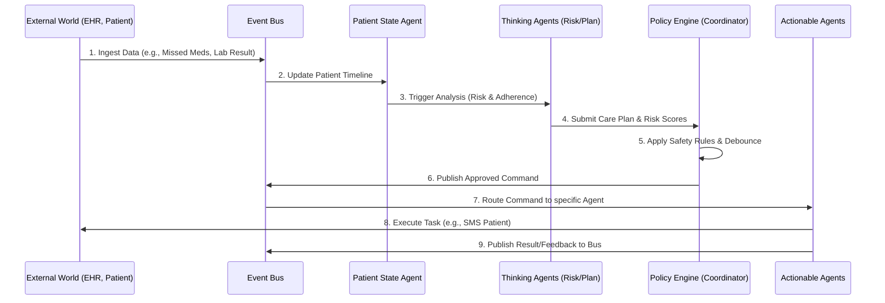

# Autonomous Care Coordination & Follow-Up Agent
## Comprehensive Technical Solution & Agent Specification

---

## 1. System Overview & Objectives

The Autonomous Care Coordination Agent is a highly specialized Multi-Agent System (MAS) designed to automate post-discharge patient care. By separating cognitive reasoning (Thinking Agents) from external interactions (Actionable Agents), the system achieves a highly reliable, event-driven architecture that prevents infinite loops, alert fatigue, and clinical errors.

**Core Objectives:**
1.  **Continuous Monitoring**: Ingest unstructured and structured data in real-time.
2.  **Proactive Risk Management**: Predict clinical deterioration before it requires emergency readmission.
3.  **Automated Coordination**: Handle the logistical burden of follow-ups, lab scheduling, and reminders.
4.  **Safe Escalation**: Ensure human doctors remain the final authority on critical decisions.

---

## 2. Detailed System Architecture

The system operates on an **Event-Driven Architecture (EDA)** built around a central Event Bus. This ensures decoupled communication and prevents circular dependencies between agents.

### 2.1 The Event Bus (The Ingestion Layer)
*   **Technology**: Apache Kafka, Redis Pub/Sub, or cloud-native alternatives (AWS EventBridge, Google Cloud Pub/Sub).
*   **Topics/Channels**:
    *   `telemetry.vitals`: Real-time data from wearables or manual entry.
    *   `clinical.ehr_updates`: Discharge summaries, lab reports from external systems.
    *   `interaction.feedback`: Responses from patients (e.g., SMS replies) or caregivers.
    *   `system.agent_commands`: Instructions from the Care Coordinator to Actionable Agents.

### 2.2 System Data Flow (Sequence Diagram)

---

## 3. The Intelligence Layer (Thinking Agents)

These agents operate internally. They do not send SMS, make API calls to hospital systems, or talk to patients. They only read state, perform computations, and generate internal plans.

### 3.1 Patient State Agent
*   **Role**: The definitive Single Source of Truth (SSOT). Maintains the temporal graph of the patient's recovery.
*   **Inputs**: Consumes from the Event Bus (`telemetry.*`, `clinical.*`, `interaction.*`).
*   **Outputs**: A structured JSON/GraphQL representation of the patient's current status and historical timeline.
*   **Internal Logic**: Acts as a state machine and central data repository. It receives structured event payloads from the Event Bus (produced by other agents that handle any necessary parsing) and updates the structured database schema (e.g., updating `medication_status` from `pending` to `taken`).

### 3.2 Monitoring Agent
*   **Role**: The Watchdog. It prevents other AI agents from constantly polling the database by firing targeted triggers.
*   **Inputs**: The structured state output from the Patient State Agent.
*   **Outputs**: Specific internal trigger events (e.g., `trigger.risk_assessment`, `trigger.adherence_check`).
*   **Internal Logic**: Uses lightweight deterministic rules (e.g., `IF new_lab_result == TRUE THEN fire trigger.risk_assessment`).

### 3.3 Risk Prediction Agent
*   **Role**: Evaluates clinical deterioration risk.
*   **Inputs**: Patient history, current vitals, latest lab reports.
*   **Outputs**: `RiskScore` (0-100), `ConfidenceInterval`, and `LLM_Explanation` (e.g., "Score is 85 due to elevated creatinine and missed Lisinopril").
*   **Internal Logic**: 
    *   *Predictive Model*: A trained XGBoost or Neural Network model handles the numerical risk scoring based on physiological data.
    *   *Clinical Explainer*: Extracts top feature importance scores (e.g., SHAP values) from the ML model. To eliminate hallucinations, it passes these exact, mathematically derived factors into a strict deterministic template (or heavily constrained LLM prompt) to generate a grounded explanation (e.g., "Risk Score 85. Top contributors: +30 from Systolic BP 180, +15 from missed Lisinopril").

### 3.4 Medication Adherence Agent
*   **Role**: Tracks compliance patterns over time.
*   **Inputs**: Prescribed schedule vs. recorded intake events.
*   **Outputs**: `AdherenceScore` (%) and `Flag` (e.g., "Repeated Non-Adherence").
*   **Internal Logic**: Time-series analysis. Looks for patterns like "consistently missing morning doses." Crucially, it cross-references with the **Pharmacy Agent's** supply status to ensure patients are not falsely penalized for systemic stock shortages or insurance denials.

### 3.5 Care Planning Agent
*   **Role**: Executes the pre-approved clinical workflow. It does not suggest new medical plans; it strictly follows the protocol set by the human doctor.
*   **Inputs**: `RiskScore`, `AdherenceScore`, current Patient State, and the Doctor's Active Care Plan.
*   **Outputs**: A proposed `CarePlanUpdate` array of logistical actions (e.g., `[Send_Refill_Reminder]`) or escalation triggers based strictly on the doctor's parameters.
*   **Internal Logic**: Evaluates the patient's current state against the doctor-configured rules of the active care plan. Before executing any standing order, it performs a strict **Contraindication Check** against an external medical API (e.g., Lexicomp/Epocrates). If a new state variable (e.g., a new diagnosis from an external EHR) conflicts with the current plan, it halts execution and immediately escalates to the prescribing physician.

### 3.6 Care Coordinator Agent (Policy Engine)
*   **Role**: The Governor. It ensures system safety, prevents alert fatigue, and handles conflict resolution.
*   **Inputs**: Proposed `CarePlanUpdate` from the Planning Agent.
*   **Outputs**: Final, validated commands sent to the Event Bus (e.g., `command.patient_agent.send_reminder`).
*   **Internal Logic**: 
    *   *Conflict Resolution*: Hard-coded tie-breakers. (e.g., If Adherence is 100% but Risk is 90%, prioritize Risk and escalate to Doctor).
    *   *Debouncing*: If 5 minor state changes happen in 10 minutes, it batches them into a single update rather than sending 5 commands. **Critical Override**: High-risk clinical events instantly bypass this debounce timer and are published immediately.
    *   *Safety Guardrails*: Blocks LLM hallucinations (e.g., prevents the system from autonomously prescribing new medications).

---

## 4. The Execution Layer (Actionable Agents)

These agents have strictly scoped permissions to interact with the outside world. They receive commands from the Event Bus, execute them, and report back.

### 4.1 Patient Agent
*   **Role**: The primary interface for the patient.
*   **Technology**: SMS (Twilio), WhatsApp, or automated Voice APIs.
*   **Capabilities**: Sends friendly reminders ("Time for your medication!"), conducts conversational check-ins ("How is your pain today on a scale of 1-10?"), and shares diet/exercise education.
*   **Feedback**: Parses natural language replies from the patient, structures the sentiment/symptoms, and pushes it to the Event Bus.

### 4.2 Caregiver Agent
*   **Role**: The secondary interface for the patient's support network.
*   **Technology**: SMS / Email.
*   **Capabilities**: Notifies family of milestones ("Dad's vitals look great today!"). Triggered heavily during low-severity escalations when the patient is unresponsive.

### 4.3 Nurse Agent
*   **Role**: Orchestrates nursing workflows and home health logistics.
*   **Technology**: Integration with hospital EHR/Nursing portals.
*   **Capabilities**: Automatically adds patients to a nurse's daily call list, schedules home visits for wound care, and ingests the nurse's clinical notes post-visit.

### 4.4 Doctor Agent
*   **Role**: The clinical decision hub.
*   **Technology**: Secure Web Dashboard / Pager alerts.
*   **Capabilities**: Does not replace the doctor. It prepares a highly condensed, relevant summary of *why* the patient is being escalated. It presents actionable buttons (e.g., "Authorize Readmission", "Adjust Prescription") for the human doctor to click.

### 4.5 Laboratory Agent
*   **Role**: Coordinates diagnostics.
*   **Technology**: HL7/FHIR integrations with lab systems like Quest/Labcorp.
*   **Capabilities**: Sends scheduling requests, pushes fasting reminders to the Patient Agent, and ingests the resulting PDF/JSON lab reports.

### 4.6 Pharmacy Agent
*   **Role**: Manages the medication supply chain.
*   **Technology**: Pharmacy Benefit Manager (PBM) APIs / Surescripts.
*   **Capabilities**: Proactively sends refill authorization requests 10 days before the current medication supply is depleted (if the prescription is still active). Checks stock availability, reminds the patient to pick it up, and flags if a prescription is delayed due to stock issues so the Adherence Agent is informed.

### 4.7 Insurance Agent
*   **Role**: Administrative support for billing and authorizations.
*   **Technology**: Payer APIs (e.g., Change Healthcare).
*   **Capabilities**: Strictly reactive. Only triggers *after* the Doctor Agent records a confirmed clinical decision. Pre-fills prior authorization forms and validates active policy status to speed up emergency admissions.

---

## 5. Escalation & Safety State Machine

To prevent infinite loops where a patient or caregiver ignores messages, the system enforces a strict State Machine with Timeouts.

### The Timeout State Machine

1.  **State: LOW_SEVERITY (Triggered by missed meds/minor vitals change)**
    *   **Action**: Patient Agent sends Reminder.
    *   **Timer Starts**: `T_Patient_Response = 4 hours`.
    *   **Transition A**: If patient responds -> Resolve back to Normal.
    *   **Transition B**: If timer expires -> Transition to Caregiver Notification.
    
2.  **State: CAREGIVER_ESCALATION**
    *   **Action**: Caregiver Agent sends Alert.
    *   **Timer Starts**: `T_Caregiver_Response = 2 hours`.
    *   **Transition A**: If caregiver resolves it -> Resolve back to Normal.
    *   **Transition B**: If timer expires -> Automatically upgrade to MEDIUM_SEVERITY.

3.  **State: MEDIUM_SEVERITY (Triggered by repeated ignorance or moderate symptoms)**
    *   **Action**: Nurse Agent adds patient to the urgent call queue.
    *   **Human Checkpoint**: Nurse calls patient. If the nurse determines clinical risk, the Nurse clicks "Escalate" on their dashboard -> Transition to HIGH_SEVERITY.

4.  **State: HIGH_SEVERITY (Triggered by Nurse or Risk Prediction Agent)**
    *   **Action**: Doctor Agent immediately pages the on-call physician with the AI-generated clinical summary. Caregiver and Nurse are CC'd. 
    *   **Resolution**: Human Doctor authorizes intervention (e.g., ER visit). Insurance Agent is finally triggered to prepare paperwork.
